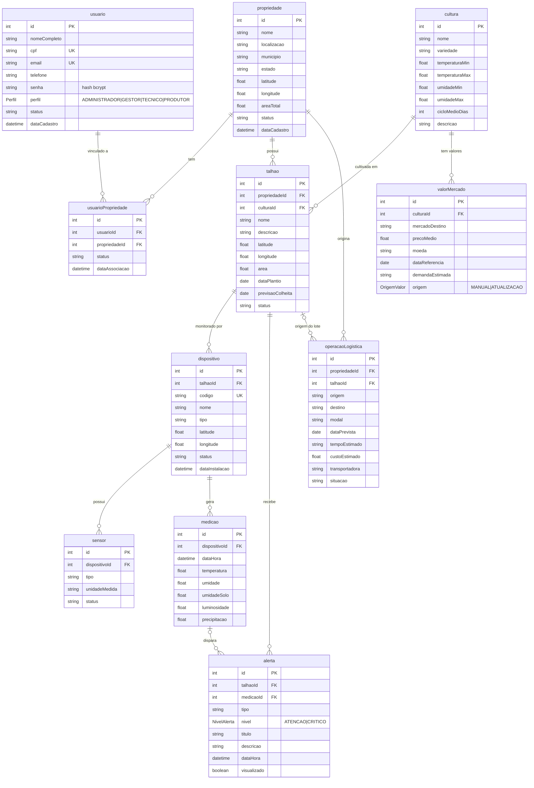

# SIVALE — Diagrama ER

Fonte da verdade: `prisma/schema.prisma`. Cole o bloco abaixo em https://mermaid.live para exportar PNG/SVG.

## Decisões de modelagem

- **Usuário ↔ Propriedade é N:N** por `usuarioPropriedade`. O papel vem de `usuario.perfil`. No MVP, TÉCNICO e PRODUTOR têm as mesmas permissões (V2: restrição por menor privilégio).
- **Talhão** é a área física; a cultura é atributo dele (`culturaId`). Latitude e longitude existem em Propriedade e Talhão (e no Dispositivo).
- **Medição** guarda temperatura e umidade coletadas juntas por dispositivo. Os campos extras são opcionais.
- **Alerta** nasce de uma medição fora da faixa da cultura do talhão (regra no service, sem tabela de regras no MVP).
- **valorMercado** guarda valores de mercado/exportação por cultura. `origem` diferencia cadastro manual de atualização pelo botão do site. Não há job agendado.
- **operacaoLogistica** guarda as informações logísticas (requisito 11).
